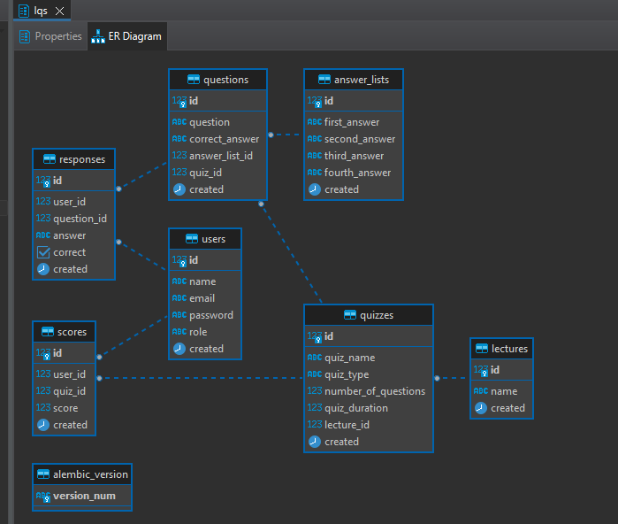

# Lecture-Quiz-Software

****

### Backend design workflow


****
### Git workflow


****
### Create Python Environment
```bash 
$ py -3.11 -m venv venv
```
****

### Activate Python Environment
windows:
```bash 
$ ./venv/Scripts/activate
```
or 

```bash 
$ source ./venv/Scripts/activate
```

Mac/Linux:
```bash
$ source ./venv/bin/activate
```

****

### Install all dependencies, db_models and apis for lqs_db

```bash
$ ./local/install_dependencies/lqs_db_api.sh
```

****

## Database: lqs_db
### Schema: lqs

#### Table 1: Users

- id (primary key, int)
- name (varchar)
- email (varchar)
- password (varchar, hashed)
- role (ENUM, "student" or "instructor")

#### Table 2: Lectures

- id (primary key, int)
- lecture_name (varchar)
- lecture_date (date)
- instructor_id (int, foreign key referencing user_id in Users table)
- number_of_students (int)
#### Table 3: Quizzes

- quiz_id (primary key, int)
- quiz_name (varchar)
- quiz_type (ENUM, "multiple-choice")
- quiz_duration (int, in minutes)
- lecture_id (int, foreign key referencing lecture_id in Lectures table)
#### Table 4: Questions

- question_id (primary key, int)
- question_text (text)
- correct_answer (varchar)
- quiz_id (int, foreign key referencing quiz_id in Quizzes table)
#### Table 5: Responses

- response_id (primary key, int)
- user_id (int, foreign key referencing user_id in Users table)
- question_id (int, foreign key referencing question_id in Questions table)
- selected_answer (varchar)
- is_correct (boolean)
- response_time (int, in seconds)
#### Table 6: Scores

- score_id (primary key, int)
- user_id (int, foreign key referencing user_id in Users table)
- quiz_id (int, foreign key referencing quiz_id in Quizzes table)
- score (int, out of total number of questions in quiz)
- score_date (date)

****



****
## Angular Build and Run

- ### First make sure that you have Node v18.12.1 or newer installed:
  - https://nodejs.org/en/download/
- run ```node --version``` in your terminal to make sure you have installed it :


- Once you have node, go ahead and install Angular CLI:
```bash
$ npm install -g @angular/cli
```
Note that if you are running this on Windows powershell, you will need to change ExecutionPolicy:
```bash
$ Set-ExecutionPolicy -Scope CurrentUser -ExecutionPolicy RemoteSigned
```

Once you get these done, you can run build and run the project:
```bash
$ cd lqs_ui
```
then
```bash
$ ng serve --open
```
Now you should see the following:
